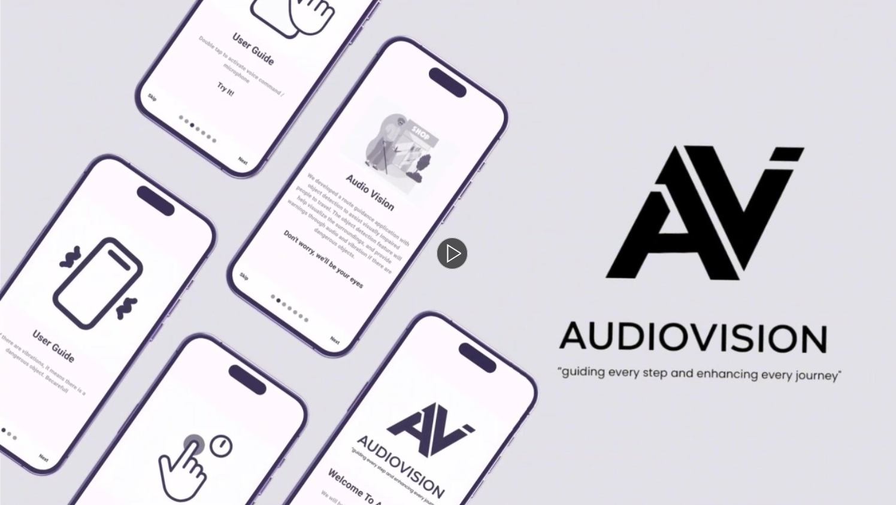

# 🎓 AudioVision – A Voice-Based Navigation App for the Visually Impaired 🗺️🎙️

AudioVision is our **Final Year Capstone Project** developed at **President University**, aimed at enhancing **mobility, safety, and independence** for visually impaired individuals through smart voice-based navigation and real-time object detection.

Built using **Flutter**, the application integrates **Google Maps**, **YOLO object detection**, and **speech technologies** to deliver an intuitive and accessible navigation experience.

---

## 🔍 What is AudioVision?

AudioVision is an assistive navigation system that converts map and environmental data into **real-time voice guidance**, enabling visually impaired users to move freely and safely without relying on visual cues.

Whether navigating city streets, identifying nearby landmarks, or avoiding obstacles, AudioVision provides a seamless, speech-based experience.

---

## 🔥 Key Features

- ✅ **Voice-Guided Navigation**  
  Real-time audio directions to guide users safely through their environment.

- ✅ **Object & Obstacle Detection**  
  Uses computer vision (YOLO) to detect obstacles like poles, people, and vehicles and provides immediate audio feedback.

- ✅ **Essential Location Recognition**  
  Identifies public facilities such as bus stops, buildings, and other landmarks.

- ✅ **Voice Command Interaction**  
  Allows users to search for locations and routes using simple voice input, eliminating the need for visual interaction.

---

## 🛠️ Technologies Used

- **Flutter** – Cross-platform mobile app development
- **Google Maps & Directions API** – Navigation and route guidance
- **YOLO (You Only Look Once)** – Real-time object detection
- **Speech-to-Text & Text-to-Speech** – For voice command interaction and audio feedback
- **Firebase** – (Optional) For user data storage and analytics

---

## 🎯 Project Goals

To develop an **inclusive, accessible, and intelligent navigation solution** that empowers visually impaired individuals to navigate their surroundings independently, increasing safety and confidence in public spaces.

---

## 📽️ Demo & Resources

- 📘 **User Guide:**  
  [AudioVision User Manual (Google Docs)](https://docs.google.com/document/d/1SOcSMDXuP9lyCfzqo7yM3vEEQ1vDpc1XKW4IgGBkk-0/edit?usp=sharing)

- 🎥 **Demo Video:**  
  [Watch on YouTube](https://youtu.be/WO8DyqMLm74?si=TicyK5jmDLdcjo-M)

- 📢 **Project Introduction:**  
  

---

## 🌍 International Impact

While developing AudioVision, we aimed to meet global accessibility needs. As part of my broader contributions to tech for social good, this project reflects my commitment to leveraging software development for **positive impact and inclusion**.

---

## 🤝 Contributions & Acknowledgments

This project was developed by a passionate team of two students as part of our Bachelor's thesis. Special thanks to our mentors, peers, and test users who helped shape the product through valuable feedback and support.

---

## 💬 Feedback & Collaboration

This project is still evolving! We welcome ideas, feedback, or collaboration opportunities from developers, researchers, NGOs, or accessibility advocates. Feel free to reach out!

---

